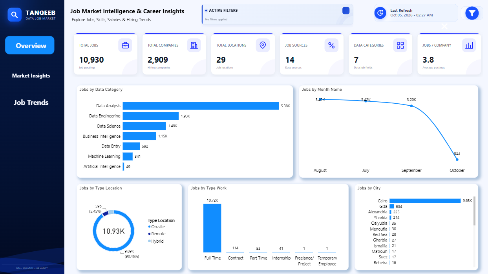

# 📊 Tanqeeb Job Market Insights

A data analytics project focused on exploring the job market across major data-related fields using **Python Web Scraping** and **Power BI**.

The project collects job listings from Tanqeeb, processes the data using Python and Pandas, and transforms the results into an interactive Power BI dashboard.

---

# 🐍 Web Scraping

The job market data was collected from Tanqeeb using Python, Requests, BeautifulSoup, and Pandas.

The scraping process covers seven major data-related categories:

- Data Analysis
- Data Science
- Data Engineering
- Data Entry
- Business Intelligence
- Machine Learning
- Artificial Intelligence

### Scraping Code

```python
import requests
from bs4 import BeautifulSoup
import time
import pandas as pd

Jobs_tanqeeb = []

categories = {
    "Data Analysis": {"query": "Data+Analysis", "pages": 296},
    "Data Science": {"query": "Data+Science", "pages": 131},
    "Data Engineering": {"query": "Data+Engineering", "pages": 231},
    "Data Entry": {"query": "Data+Entry", "pages": 38},
    "Business Intelligence": {"query": "Business+Intelligence", "pages": 108},
    "Machine Learning": {"query": "Machine+Learning", "pages": 43},
    "Artificial Intelligence": {"query": "Artificial+Intelligence", "pages": 30}
}

headers = {
    "User-Agent": "Mozilla/5.0 (Windows NT 10.0; Win64; x64) "
                  "AppleWebKit/537.36 (KHTML, like Gecko) "
                  "Chrome/154.0.0.0 Safari/537.36"
}

session = requests.Session()
session.headers.update(headers)

for category, info in categories.items():

    query = info["query"]
    pages = info["pages"]

    print(f"\n========== {category} | {pages} Pages ==========\n")

    for page_number in range(1, pages + 1):

        url = (
            f"https://egypt.tanqeeb.com/jobs/search"
            f"?keywords={query}&page_no={page_number}"
        )

        try:

            response = session.get(url, timeout=30)
            response.raise_for_status()

            soup = BeautifulSoup(response.text, "html.parser")

            jobs = soup.find_all(
                "div",
                class_="search-job-card"
            )

            print(
                f"{category} | "
                f"Page: {page_number}/{pages} | "
                f"Jobs: {len(jobs)}"
            )

            for i in jobs:

                title = i.select_one(
                    "a.search-job-title-link"
                )
                title = (
                    title.get_text(strip=True)
                    if title else None
                )

                type_location = i.select_one(
                    "span.search-job-workplace-location"
                )
                type_location = (
                    type_location.get_text(strip=True)
                    if type_location else None
                )

                date = i.select_one(
                    "span.search-job-date"
                )
                date = (
                    date.get_text(strip=True)
                    if date else None
                )

                site_category = i.select_one(
                    "div.search-job-categories"
                )
                site_category = (
                    site_category.get_text(strip=True)
                    if site_category else None
                )

                company_name = i.select_one(
                    "div.search-job-company-name"
                )
                company_name = (
                    company_name.get_text(strip=True)
                    if company_name else None
                )

                type_work = i.select_one(
                    "span.search-job-tag"
                )
                type_work = (
                    type_work.get_text(strip=True)
                    if type_work else None
                )

                source = i.select_one(
                    "span.search-job-source"
                )
                source = (
                    source.get_text(strip=True)
                    if source else None
                )

                location_element = i.select_one(
                    "div.search-job-company-city span"
                )
                location = (
                    location_element.get_text(strip=True)
                    if location_element else None
                )

                job_link = i.select_one(
                    "a.search-job-title-link"
                )

                job_link = (
                    "https://egypt.tanqeeb.com"
                    + job_link.get("href")
                    if job_link and job_link.get("href")
                    else None
                )

                Jobs_tanqeeb.append({
                    "Title": title,
                    "Type_Location": type_location,
                    "Date": date,
                    "Category": site_category,
                    "Data_Category": category,
                    "Company_name": company_name,
                    "Type_Work": type_work,
                    "Source": source,
                    "Location": location,
                    "Job_Link": job_link,
                    "Page": page_number
                })

            time.sleep(0.5)

        except requests.exceptions.RequestException as e:

            print(
                f"ERROR | {category} | "
                f"Page: {page_number} | {e}"
            )

            time.sleep(3)

            continue

df = pd.DataFrame(Jobs_tanqeeb)

print("\n====================================")
print("Scraping Finished")
print("Total Jobs:", len(df))
print("====================================")

print("\nJobs per Data Category:")
print(df["Data_Category"].value_counts())

df.head()
```

---

# 🔎 Code Explanation

The scraping workflow was designed to collect and structure job listings from Tanqeeb across multiple data-related categories.

### 1. Website Requests

`Requests` is used to send HTTP requests to Tanqeeb and retrieve the HTML content of each search page.

### 2. HTML Parsing

`BeautifulSoup` is used to parse the returned HTML and locate individual job cards.

### 3. Multiple Data Categories

A dictionary is used to define the search categories and the number of pages to scrape for each category.

### 4. Job Data Extraction

For every job listing, the scraper extracts information such as:

- Job Title
- Workplace Location Type
- Date
- Job Category
- Data Category
- Company Name
- Work Type
- Source
- Location
- Job Link
- Page Number

### 5. Data Storage

All extracted job listings are stored inside a Python list and then converted into a Pandas DataFrame.

### 6. Final Dataset

The resulting DataFrame contains the structured job market data that was later exported to CSV and used as the source for the Power BI dashboard.

---

# 📊 Dashboard Preview

## 🖥️ Cover Page — Dashboard Introduction

The dashboard starts with a dedicated cover page that introduces the **Tanqeeb Job Market Insights** project and provides the visual identity of the dashboard.


---

## 📌 Overview — Overall Job Market

The Overview page provides a high-level summary of the collected job market data, including total jobs, companies, locations, sources, data categories, and average jobs per company.



---

## 📈 Job Trends — Exploring Job Opportunities

The Job Trends page explores how job opportunities are distributed across seniority signals, job sources, categories, and individual job listings.


---

## 💼 Market Insights — Hiring & Workplace Analysis

The Market Insights page focuses on hiring patterns, companies, workplace types, and the distribution of opportunities across different data-related categories.


---

## 🧩 Data Model — Power BI Architecture

The Power BI data model connects the main job fact table with dimensions such as category, company, date, location, source, work type, and workplace.


---

# 📈 Key Insights

### Data Category Demand

Data Analysis represents the largest category with approximately **5.38K jobs**, followed by:

| Data Category | Jobs |
|---|---:|
| Data Analysis | 5.38K |
| Data Engineering | 1.93K |
| Data Science | 1.49K |
| Business Intelligence | 1.15K |
| Data Entry | 592 |
| Machine Learning | 341 |
| Artificial Intelligence | 49 |

### Geographic Distribution

- **Cairo:** approximately 9.63K jobs
- **Giza:** approximately 584 jobs
- **Alexandria:** approximately 225 jobs

### Workplace Distribution

- **On-site:** 90.46%
- **Remote:** 5.45%
- **Hybrid:** remaining share

### Employment Type

Full-time opportunities dominate the dataset with approximately **10.72K jobs**.

---

# 🛠️ Tools & Technologies

- Python
- Requests
- BeautifulSoup
- Pandas
- Jupyter Notebook
- CSV
- Microsoft Power BI

---

# 📂 Project Structure

```text
tanqeeb-job-market-scrap/
│
├── Tankeeep_Web.pbix
├── README.md
│
├── Data/
│   └── Job Market Dataset.csv
│
├── Images/
│   ├── Cover Page.png
│   ├── Overview.png
│   ├── Job Trends.png
│   ├── Market Insights.png
│   └── Data Modeling.png
│
└── Notebook/
    ├── Web Scraping Notebook.ipynb
    └── Web Scraping Notebook.pdf
```

---

## 👨‍💻 Project Skills

**Web Scraping • Python • Pandas • Data Cleaning • Data Modeling • Power BI • Data Visualization • Dashboard Design • Data Analysis**
